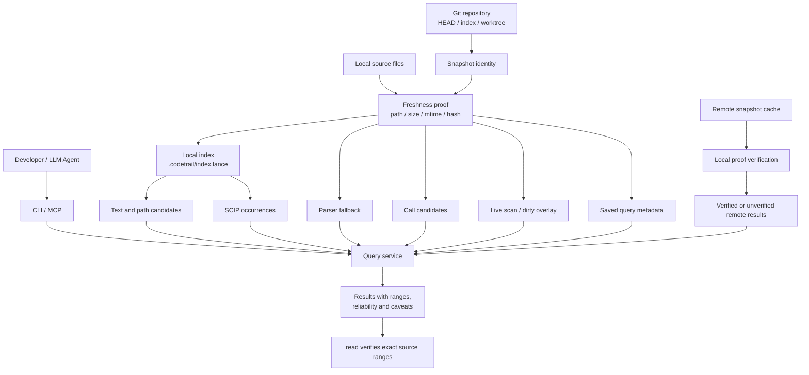

# CodeTrail
[](https://github.com/mars167/CodeTrail/releases)

[中文](README.zh-CN.md)

A local-index-first code search tool for fast, verifiable source evidence.

CodeTrail's core promise is not to "understand the code"—it is to return verifiable evidence quickly. Search, symbol location, range reading, definitions, references, call candidates, index status, and MCP output are all organized around readable results, pagination, and caveats.

## Installation

macOS/Linux:

```bash
curl -fsSL https://raw.githubusercontent.com/mars167/CodeTrail/main/install.sh | sh
```

Windows PowerShell:

```powershell
irm https://raw.githubusercontent.com/mars167/CodeTrail/main/install.ps1 | iex
```

The installer downloads the latest GitHub Release assets for your OS, verifies `SHA256SUMS`, and installs `codetrail`. On macOS/Linux, it is installed by default to `~/.local/bin`. On Windows, it is installed to `%LOCALAPPDATA%\Programs\codetrail\bin` and added to your user `PATH`.

Install a specific version:

```bash
curl -fsSL https://raw.githubusercontent.com/mars167/CodeTrail/main/install.sh | sh -s -- --version v0.1.4
```

```powershell
$env:CODETRAIL_VERSION = "v0.1.4"; irm https://raw.githubusercontent.com/mars167/CodeTrail/main/install.ps1 | iex
```

## Quick Start

```bash
codetrail index build
codetrail find "TODO"
codetrail read README.md:1-40
```

Default output is concise text. For machine consumption, use `--output json` or `--output jsonl`. For full argument details, run `codetrail --help` and check `src/cli.rs`.

## Common Commands

Content and path search:

```bash
codetrail find "TODO"
codetrail grep "fn [a-z_]+"
codetrail files "README"
codetrail glob "src/**/*.rs"
```

Range read and symbol lookup:

```bash
codetrail read README.md:1-40
codetrail defs main
codetrail refs main
codetrail symbols query
```

Indexing and saved query:

```bash
codetrail index build
codetrail index status
codetrail find "TODO" --save-query todo-find
codetrail query replay todo-find
```

When debugging local issues, add `-v`/`--verbose` to send diagnostic logs to stderr and keep stdout clean for JSON/text output:

```bash
codetrail -v --output json index build --force > out.json 2> debug.log
```

MCP integration:

```bash
codetrail mcp
```

## Result Reliability

Public JSON responses only include `results`, `page`, and `caveats`. Each caveat carries a stable `severity` and `category` to distinguish risk warnings from expected capability-level caveats.

Before editing code, verify search, remote, or graph-derived results with `read`. Different source types are represented with different reliability levels: text hits are verifiable clues, SCIP occurrences are more precise but still need range review, parser fallback and call candidates are not semantic proof, and remote results must be clearly marked when they are not aligned with local file proof.

## Architecture

CodeTrail separates "searchability" from "trustworthiness": indexing speeds up discovery, but answers must always be traceable back to local files, snapshots, ranges, and reliability notes. CLI and MCP share the same query service so different integrations do not get different facts.



Core boundaries:

- Snapshot is the truth boundary: results must declare whether they come from commit, staged, or worktree state; different sources must not be merged into one untraceable answer.
- Local index is the acceleration layer: when index data is missing, stale, or partial, queries should fall back to live scanning, dirty overlay, or return clear caveats.
- Query service is the integration boundary: CLI, MCP, saved query replay, and remote snapshots all share the same public JSON/text projection.
- Reliability is an interface contract: text hits, exact occurrences, parser fallbacks, call candidates, and remote results must use different reliability levels; key edits should still be rechecked with `read`.
- Remote and saved query are not ground truth: remote is only confidence-boosting when aligned with local proof; saved query stores only replay metadata, never full result payloads.

## Agent Skill

This repository includes an LLM Agent Skill:

```text
skills/codetrail/
```

It explains how an agent should use `codetrail` to collect verifiable source evidence, apply reliability grading, replay saved queries, check index freshness, and validate MCP/JSON contracts. When using with this repository, install the Skill from the repo:

```bash
npx skills add https://github.com/mars167/CodeTrail --skill codetrail
```

If you are already inside this repository checkout, install from local root:

```bash
npx skills add . --skill codetrail
```

## Documentation

Design references:

| Document | Details |
| --- | --- |
| [`docs/00-design-summary.md`](docs/00-design-summary.md) | Product positioning, boundaries, and architecture overview |
| [`docs/01-architecture.md`](docs/01-architecture.md) | Snapshot, index, query, watcher, and remote architecture |
| [`docs/02-command-contract.md`](docs/02-command-contract.md) | Command families, JSON responses, and reliability contracts |
| [`docs/03-quality.md`](docs/03-quality.md) | Local quality gate, CI mapping, performance and reliability safeguards |

Implementation details should be treated as the source of truth in `src/`, `tests/`, and `scripts/`.

## Local Development

```bash
cargo build
cargo test
```

Unified local/CI quality entrypoint:

```bash
scripts/quality-gate.sh pr
scripts/quality-gate.sh main
scripts/quality-gate.sh bench
```

`quick` is an alias for `pr`, `cli` is an alias for `main`, and `full` runs `main` then `bench`.

## Contributing

Please report issues and improvements via pull requests. If you touch command contracts, reliability levels, indexing, remote behavior, watcher logic, or MCP output, update related documentation and run the relevant quality gates.

## License

MIT. See [LICENSE](LICENSE).
