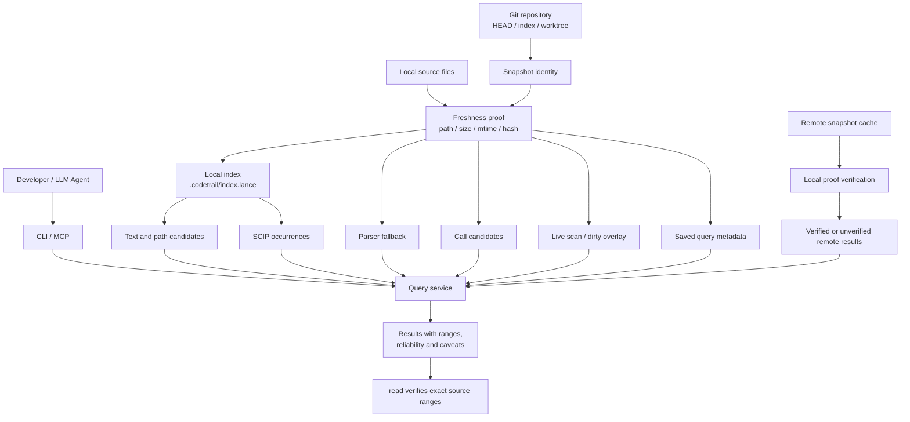

# CodeTrail
[](https://github.com/mars167/CodeTrail/releases)

[English](README.md)

基于本地索引的代码搜索工具，专注于快速定位可验证的源码证据。

CodeTrail 的核心承诺不是“理解代码”，而是快速给出可验证的代码证据：搜索、路径定位、范围读取、定义、引用、调用候选、索引状态和 MCP 工具输出都围绕可读取的结果、分页和 caveats 组织。

## 安装

macOS/Linux:

```bash
curl -fsSL https://raw.githubusercontent.com/mars167/CodeTrail/main/install.sh | sh
```

Windows PowerShell:

```powershell
irm https://raw.githubusercontent.com/mars167/CodeTrail/main/install.ps1 | iex
```

安装器会根据当前系统下载最新 GitHub Release 资产，校验 `SHA256SUMS`，并安装 `codetrail`。macOS/Linux 默认安装到 `~/.local/bin`，Windows 默认安装到 `%LOCALAPPDATA%\Programs\codetrail\bin` 并写入用户 `PATH`。

安装指定版本：

```bash
curl -fsSL https://raw.githubusercontent.com/mars167/CodeTrail/main/install.sh | sh -s -- --version v0.1.4
```

```powershell
$env:CODETRAIL_VERSION = "v0.1.4"; irm https://raw.githubusercontent.com/mars167/CodeTrail/main/install.ps1 | iex
```

## 快速开始

```bash
codetrail index build
codetrail find "TODO"
codetrail read README.md:1-40
```

默认输出是短文本；需要机器读取时使用 `--output json` 或 `--output jsonl`。命令参数以 `codetrail --help` 和 `src/cli.rs` 为准。

## 常用命令

内容与路径搜索：

```bash
codetrail find "TODO"
codetrail grep "fn [a-z_]+"
codetrail files "README"
codetrail glob "src/**/*.rs"
```

范围读取与符号定位：

```bash
codetrail read README.md:1-40
codetrail defs main
codetrail refs main
codetrail symbols query
```

索引与 saved query：

```bash
codetrail index build
codetrail index status
codetrail find "TODO" --save-query todo-find
codetrail query replay todo-find
```

调试本地问题时可以加 `-v`/`--verbose`，诊断日志会写到 stderr，不污染 stdout 的 JSON/text 结果：

```bash
codetrail -v --output json index build --force > out.json 2> debug.log
```

MCP 集成：

```bash
codetrail mcp
```

## 结果可信度

公开 JSON 只包含 `results`、`page` 和 `caveats`；每个 caveat 都带稳定 `severity` 与 `category`，用于区分风险警告和预期能力级别说明。

修改代码前用 `read` 验证搜索、remote 或图候选结果。不同来源的结果会用不同可靠性级别表达：文本命中是可验证线索，SCIP occurrence 更精确但仍应复核范围，parser fallback 和调用候选不能当作语义证明，remote 结果必须区分是否与本地 file proof 对齐。

## 项目架构设计

CodeTrail 把“可搜索”和“可信任”分开设计：索引用来加速定位，结果仍必须能回到本地文件、snapshot、范围和可靠性说明。CLI 与 MCP 入口共享同一套查询服务，避免不同集成看到不同事实。



核心边界：

- Snapshot 是事实边界：查询结果必须说明来自 commit、staged 还是当前 worktree，不能把不同来源混成一个无出处结果。
- 本地索引是加速层：索引缺失、过期或只覆盖部分文件时，查询应回退到实时扫描、dirty overlay，或返回明确 caveat。
- 查询服务是集成边界：CLI、MCP、saved query replay 和 remote snapshot 都通过同一 public JSON/text 投影输出。
- Reliability 是调用契约：文本命中、精确 occurrence、parser fallback、调用候选和 remote 结果要用不同可靠性级别表达，关键编辑前仍用 `read` 复核。
- Remote 和 saved query 不是真相源：remote 只在本地 proof 对齐时提升可信度；saved query 只保存可重放元数据，不保存结果正文。

## Agent Skill

本仓库包含给 LLM Agent 使用的 Skill 和 agent 模板：

```text
skills/codetrail/
```

它说明了 agent 应如何用 `codetrail` 获取可验证的源码证据、处理 reliability 分级、重放 saved query、检查 index freshness，并验证 MCP/JSON 契约。需要随项目使用时，可以通过 skills CLI 从仓库安装指定 Skill：

```bash
npx skills add https://github.com/mars167/CodeTrail --skill codetrail
```

如果已经在本仓库 checkout 中，也可以从仓库根目录安装：

```bash
npx skills add . --skill codetrail
```

多步仓库调查应安装 OpenCode subagent 模板：

```text
skills/codetrail/agents/opencode/codetrail-evidence.md
```

安装到 `.opencode/agents/` 或 `~/.config/opencode/agents/`。subagent 负责
任务相关的查询顺序和证据压缩；CodeTrail 本身仍然只作为搜索/导航工具层。
不要把 `brief`、`context` 或 `analyze-*` 这类任务级命令加到 CLI。

## 文档

更多设计说明：

| 文档 | 内容 |
| --- | --- |
| [`docs/00-design-summary.md`](docs/00-design-summary.md) | 产品定位、文档边界、总览图 |
| [`docs/01-architecture.md`](docs/01-architecture.md) | snapshot、索引、查询、watcher、remote 架构 |
| [`docs/02-command-contract.md`](docs/02-command-contract.md) | 命令族、JSON 响应、可靠性契约 |
| [`docs/03-quality.md`](docs/03-quality.md) | 本地质量门禁、CI 映射、性能看护边界 |

实现细节以 `src/`、`tests/` 和 `scripts/` 为准。

## 本地开发

```bash
cargo build
cargo test
```

本地与 CI 的统一质量入口：

```bash
scripts/quality-gate.sh pr
scripts/quality-gate.sh main
scripts/quality-gate.sh bench
```

`quick` 是 `pr` 的别名；`cli` 是 `main` 的别名；`full` 会依次运行 `main` 和 `bench`。

## 贡献

欢迎通过 issue 或 pull request 反馈问题、补充场景和改进实现。涉及命令契约、可靠性级别、索引、remote、watcher 或 MCP 输出的改动，请同步更新相关文档并运行对应质量门禁。

## License

MIT，详见 [LICENSE](LICENSE)。
