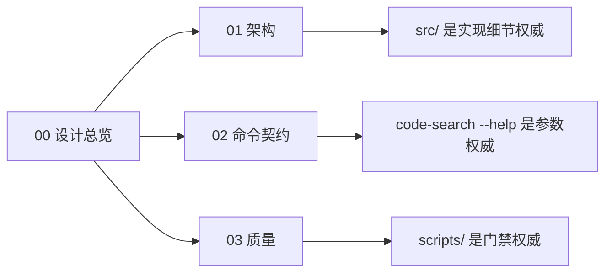
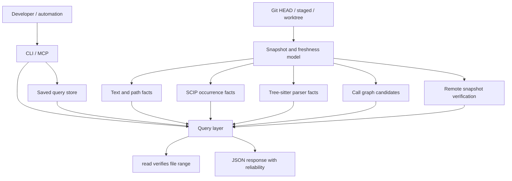

# 设计总览

## 阅读地图

| 文档 | 内容 |
| --- | --- |
| `00-design-summary.md` | 产品定位、系统图、可靠性等级 |
| `01-architecture.md` | snapshot/index/query/freshness 边界 |
| `02-command-contract.md` | 命令族、JSON 响应和 reliability 契约 |
| `03-quality.md` | 验证入口、门禁分层和 CI 映射 |

## 产品定位

`code-search` 是本地优先、Git 优先的代码搜索与跳转工具，目标是让开发者和自动化工具像使用 IDE 一样获取窄而可靠的代码证据。

它提供：

- 内容搜索、路径搜索、目录浏览和范围读取。
- 定义、引用、符号、调用候选和变更状态。
- 本地索引、Git hook、watcher、saved query、remote pack/unpack 和 MCP 入口。
- 每个响应的 snapshot、producer、freshness 与 reliability 信息。

它不承诺：

- 默认 embedding 或语义相似度搜索。
- 把启发式调用图伪装成精确事实。
- 用 remote 结果覆盖本地 dirty/staged 状态。
- 用 watcher 替代 Git hook 或 staged/commit snapshot。
- 把源码、测试和脚本中已经明确表达的实现细节重复成第二份说明。

## 系统图

索引是加速层，不是事实源。事实源始终是本地源码、Git 状态、文件 hash 和可读取的 range。

## 可靠性

| level | 来源 | `exact` | 使用方式 |
| --- | --- | --- | --- |
| `source_fact` | 文件系统、Git、文本和路径匹配 | `true` | 可作为源码证据；编辑前仍用 `read` 取精确范围 |
| `precise_fact` | SCIP、语言服务或编译器索引 | `true` | 可作为 IDE 级跳转事实；仍保留 range verification |
| `parser_fact` | tree-sitter AST | `false` | 确定的语法事实，不等于语义精确引用 |
| `inferred_candidate` | 图、AST heuristic、search-based inference | `false` | 只用于缩小范围，必须二次验证 |
| `freshness` | manifest、hash、watcher、index status | `false` | 描述缓存状态，不提升代码事实准确性 |
| `remote_verified` | 与本地 file proof 对齐的 remote snapshot | `false` | 可作为加速结果；关键编辑仍用 `read` 复核 |
| `remote_unverified` | 未能与本地文件对齐的 remote snapshot | `false` | 只能作为线索，不能直接用于编辑决策 |

## 贡献者参考

- 命令行参数以 `code-search --help` 和 `src/cli.rs` 为准。
- 行为细节以 `src/`、`tests/` 和 `scripts/` 为准。
- 设计文档描述稳定边界和外部契约，避免重复每个函数的实现细节。
- 新增命令、索引或输出字段时，同时更新对应的测试和契约说明。
