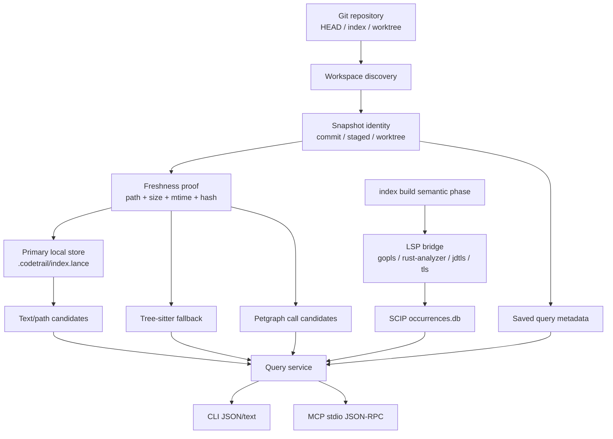
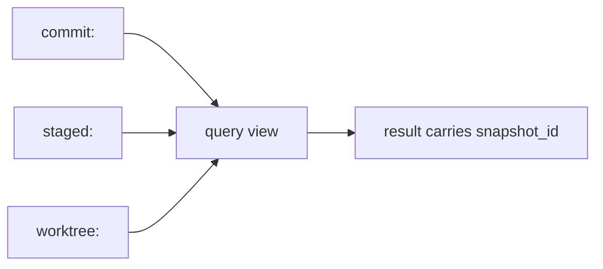
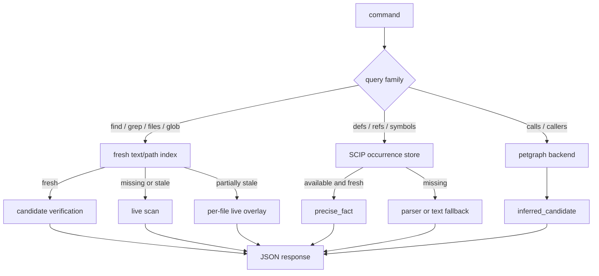
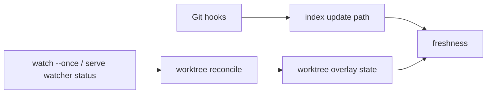
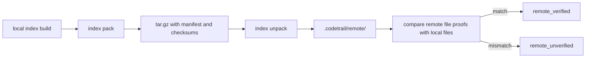
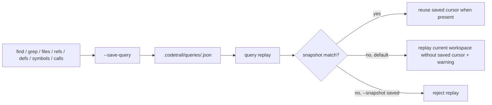

# 架构

> 本文只描述长期结构边界。当前模块名、函数名和参数以 `src/` 为准。

## 总体分层



设计重点是分层，而不是把所有能力塞进一个“代码图”。文本搜索、precise occurrence、parser fallback 和调用候选分别解决不同问题。

## Snapshot 模型



规则：

- `commit`、`staged`、`worktree` 不能混成无来源结果。
- 索引记录必须能回到 `snapshot_id`、`path`、`file_hash` 和 `range`。
- freshness 失败时，查询必须回退到实时读取，或返回明确的 stale/error 信息。
- dirty worktree 可以按文件混合：未变更且 proof 匹配的文件继续走 fresh index，变更或新增文件走 live overlay，并在结果上暴露 producer/source reason。
- remote snapshot 只能加速或共享；不能覆盖本地 dirty/staged 事实。

## 存储边界

```text
.codetrail/
  index.lance/              # primary local store
  working/manifest.json     # pack/unpack compatibility
  staged/manifest.json
  scip/<snapshot-key>/      # occurrences.db + generation.json
  graph/<snapshot-key>/     # petgraph.bin + graph manifest
  remote/<snapshot-key>/    # unpacked remote snapshots
  queries/<name>.json       # saved query replay metadata
```

当前本地索引以 LanceDB 为主，保存 snapshot 行、file catalog、file proof 和 gram postings。SCIP occurrence 与 petgraph 使用各自目录；LanceDB 中保留 parser、SCIP 和 call graph 表结构，便于后续统一存储。历史上的 `snapshots/` 和 `text/*.idx` 只作为兼容或 remote 包格式出现，不是新构建的主查询存储。

## 查询路径



`read` 是验证入口：搜索和图结果帮助定位，真正进入编辑前应读取精确范围。

## Watcher 和 Hook



- Hook 维护 Git 语义相关的 staged/commit 索引。
- Watcher 只维护 worktree overlay 和实时性状态。
- Watcher 不执行 `git add`，不修改 staged，不生成 commit snapshot。
- 当前 `watch --once` 是按需 reconcile；`serve` 暴露 query service 状态和 watcher 状态。

## 语义索引（LSP → SCIP）

`index build` 在文本索引与调用图之后，默认 best-effort 启动各语言 LSP（`gopls`、`rust-analyzer`、`jdtls`、`typescript-language-server`），通过 `documentSymbol` 与采样 `references` 合成 `SemanticOccurrence`，写入 `.codetrail/scip/<snapshot-key>/occurrences.db`。

- `--no-semantic` 跳过该阶段；`index build --staged` 不运行语义阶段。
- 任何 LSP 失败只产生 partial/missing manifest 与 caveat，不阻塞 build。
- 环境变量：`CODETRAIL_LSP_<LANG>` 覆盖 server 命令；`CODETRAIL_SEMANTIC_BUDGET_MS` 控制总墙钟预算（默认 60s）。
- 若 `occurrences.db` 已与当前 snapshot 和 file hash 对齐，重复 build 会跳过语义阶段。

## Remote



Remote 适合 CI 产物、大仓预热和团队共享。remote archive 包含 text
metadata、gram postings 和 text content segment，因此 MCP remote-only
查询可以在本地源文件不可读时返回导航线索。只要本地文件无法与 remote
snapshot 对齐，结果就必须降级，且不能覆盖本地 dirty/staged/worktree 事实；
调用方需要用 `read` 重新验证可编辑源码。

## Saved Query



Saved query 只保存可重放命令、query 参数、scope、snapshot 和 cursor 元数据，不保存结果正文。它是查询工作流加速层，不是事实源；重放结果仍受当前 snapshot、freshness 和 reliability 契约约束。
