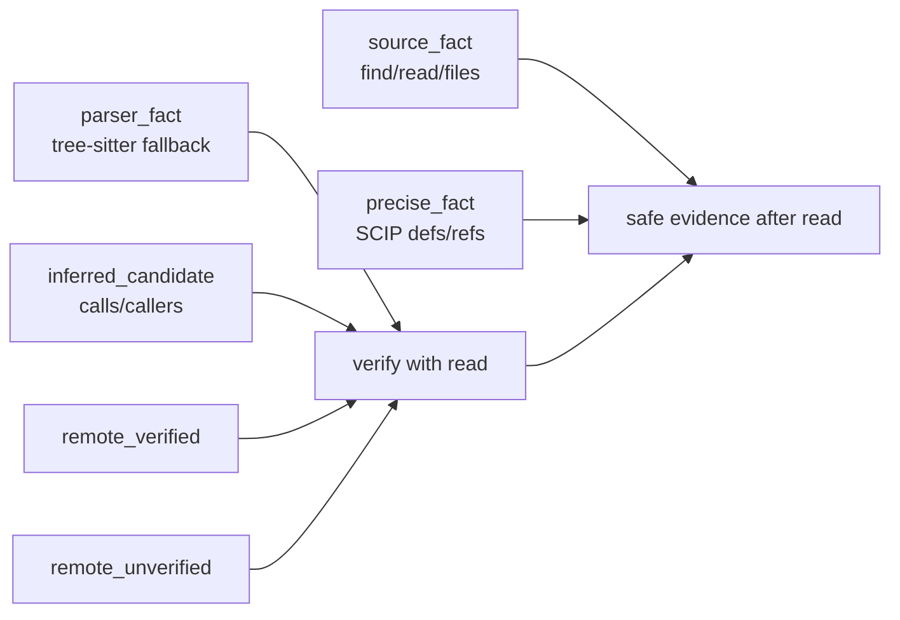

# 命令契约

> 命令参数以 `codetrail --help` 和 `src/cli.rs` 为准。本文描述调用方可以依赖的稳定命令和 JSON 契约。

## 命令族


| 族 | 命令 | 契约 |
| --- | --- | --- |
| 内容搜索 | `find`, `grep` | 返回可验证源码匹配；index 只影响速度 |
| 路径搜索 | `files`, `find-path`, `glob` | 返回 snapshot 下的路径事实 |
| 浏览读取 | `list`, `tree`, `read` | `read` 是编辑前验证入口 |
| Git 状态 | `changed`, `status` | 返回当前 workspace 与 snapshot 状态 |
| 跳转 | `defs`, `refs`, `symbols` | 优先 SCIP，缺失时降级为 parser/text fallback |
| 关系 | `calls`, `callers` | 永远是 `inferred_candidate` |
| Saved query | `--save-query`, `query replay/show/list/delete` | 保存可重放 query/scope/snapshot/cursor 元数据，不保存结果正文 |
| 索引 | `index ...`, `hooks ...` | 维护 freshness 和本地/remote 缓存 |
| 集成接口 | `mcp`, `serve`, `watch` | 包装同一套 query service 和 watcher 状态 |

任务级调查不属于命令族。`brief`、`context`、`analyze architecture` 或
`analyze data-model` 这类行为应由 Agent/subagent 模板通过上述原语组合完成，
不进入 CodeTrail CLI/MCP 的公共命令契约。

## 输出契约

默认输出是短文本，面向真实终端阅读。需要机器读取时显式传 `--output json` 或 `--output jsonl`。
MCP tool result 的 `content[0].text` 使用同一 public JSON 投影。

公开 JSON 只保留三类信息：

```json
{
  "results": [],
  "page": {
    "truncated": false,
    "nextCursor": null
  },
  "caveats": []
}
```

稳定字段：

- `results` 是唯一的主要结果载体。每条结果只保留定位、文本、符号、关系或命令结果本身需要的字段；内部审计字段、producer、read command、index freshness 和 agent next action 不进入公开 JSON。
- `page.truncated` 表示本次输出被裁切或分页，调用方应缩小查询、降低 context 或使用 `page.nextCursor` 翻页。
- `page.nextCursor` 是下一页游标；没有下一页时为 `null`。
- `caveats` 是机器可匹配的边界说明，结构为 `{code,message,severity,category}`。`severity` 目前使用 `info`、`warning` 或 `error`；`category` 目前使用 `capability`、`risk` 或 `error`。
- `severity=info, category=capability` 表示预期能力级别说明，例如没有 SCIP 时的 parser fallback、`refs` 的 identifier-boundary text search、`calls/callers` 的 `inferred_candidate`。这些不是风险警告，但调用方仍要按 `reliability` 契约验证结果。
- `severity=warning, category=risk` 表示需要调用方调整或复核的风险边界，例如 `ambiguous_results`、无匹配不可证明、宽查询保护和输出裁切。错误 caveat 使用 `severity=error, category=error`。

`--output compact-json` 是兼容别名，输出同一公开 JSON 形态。

`--output jsonl` 使用逐行事件：

```json
{"event":"result","result":{}}
{"event":"page","page":{"truncated":false,"nextCursor":null},"caveats":[]}
```

错误不会恢复旧 envelope；JSON 输出为 `results: []` 加错误 caveat，JSONL 输出一个 `page` event 加错误 caveat。

## 输出预算与上下文

- `--context` 控制结果上下文；默认 `0`，不会输出 context block。
- preview、context 和结果数量受输出预算保护；当任何层级被裁切时，`page.truncated=true` 或 `caveats` 包含 `truncated_output`。
- 宽查询 guard 仍会返回少量样本和 caveat，避免终端与机器输出被大结果集淹没。
- `read` 仍是编辑前验证入口；公开 JSON 不再内嵌 `readCommand`，调用方应使用结果里的 `path` 和 `range` 组合读取目标。

## 可靠性流转



规则：

- `exact=true` 只允许出现在 `source_fact` 或 `precise_fact`。
- `parser_fact` 可以是确定性语法事实，但不能代表 precise semantic reference resolution。
- `calls` 和 `callers` 即使来自图索引，也必须标为候选。
- remote 结果必须声明是否与本地文件 proof 对齐；`remote_verified` 仍是共享缓存结果，关键编辑前仍要 `read`。
- 公开输出通过 caveats 暴露这些边界；自动化工具应先看 `severity/category`，不要把 `info/capability` 的能力说明当成风险告警。开发者修改代码前仍应对关键结果执行 `read <file[:range]>`。

## Saved Query Replay

可保存的命令包括 `find`、`grep`、`files`、`find-path`、`glob`、`refs`、`defs`、`symbols`、`calls` 和 `callers`。

规则：

- `--save-query <name>` 写入 `.codetrail/queries/<name>.json`；name 只允许 ASCII 字母、数字、`.`、`_` 和 `-`。
- saved query 保存 command、canonicalCommand、query、scope、snapshotId、requestCursor 和 nextCursor；不会保存结果正文，也不会改变公开输出形态。
- `query replay <name>` 默认使用当前 workspace。snapshot 不匹配时会丢弃 saved cursor，按当前 scope 重跑并返回 `saved_query_snapshot_mismatch` caveat。
- `query replay <name> --snapshot saved` 要求当前 snapshot 与保存时一致；不一致时返回错误。
- `query show/list/delete` 是对本地 `.codetrail/queries/` 的文件系统操作，结果仍放在 `results`。

## Text 输出

默认 text 输出保持短、可审计、不过度设计：

- 搜索结果按 `path:line  preview` 渲染。
- `read` 直接输出文件内容。
- `calls`/`callers` 按 caller -> callee 关系渲染，并附带位置。
- `index build/update/import-scip/pack/unpack` 在 TTY 上显示加载进度；非 TTY 保持无 spinner，避免污染脚本输出。
- caveats 以短行展示，避免把内部审计、agent next action 或完整 schema 打到终端。

## 退出码

| code | 含义 |
| --- | --- |
| `0` | 命令成功 |
| `1` | 参数、用法或内部执行错误 |
| `2` | 搜索完成但没有匹配 |
| `6` | 索引存在但 freshness/verify 失败 |

其它错误码由实现按错误类型继续细化；脚本和 CI 应优先检查 JSON 与进程退出状态。
