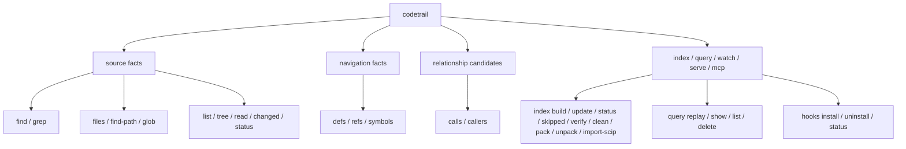
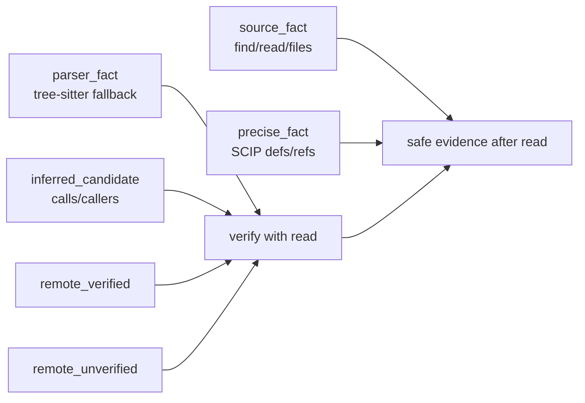

# 命令契约

> 命令参数以 `codetrail --help` 和 `src/cli.rs` 为准。本文描述调用方可以依赖的稳定命令和 JSON 契约。

## 命令族



| 族 | 命令 | 契约 |
| --- | --- | --- |
| 内容搜索 | `find`, `grep` | 返回可验证源码匹配；index 只影响速度 |
| 路径搜索 | `files`, `find-path`, `glob` | 返回 snapshot 下的路径事实 |
| 浏览读取 | `list`, `tree`, `read` | `read` 是编辑前验证入口 |
| Git 状态 | `changed`, `status` | 返回当前 workspace 与 snapshot 状态 |
| 跳转 | `defs`, `refs`, `symbols` | 优先 SCIP，缺失时降级为 parser/text fallback |
| 关系 | `calls`, `callers` | 永远是 `inferred_candidate` |
| Saved query | `--save-query`, `query replay/show/list/delete` | 保存可重放 query/scope/snapshot/cursor 元数据，不保存结果正文 |
| 索引 | `index ...`, `hooks ...` | 维护 freshness 和本地/remote 缓存 |
| 集成接口 | `mcp`, `serve`, `watch` | 包装同一套 query service 和 watcher 状态 |

任务级调查不属于命令族。`brief`、`context`、`analyze architecture` 或
`analyze data-model` 这类行为应由 Agent/subagent 模板通过上述原语组合完成，
不进入 CodeTrail CLI/MCP 的公共命令契约。

## IDE-like 搜索选项

所有搜索和导航命令共享同一套 workspace scope：

```bash
codetrail --dir src/main --ext java --file-pattern '*Service.java' find user
```

- `--dir <dir>` 可重复，workspace-relative，多个目录为 OR。遍历从这些目录
  启动，不先扫全仓库再过滤。
- `--ext <ext>` 可重复，接受 `java` 或 `.java`，按路径后缀字符串匹配。
- `--file-pattern <pattern>` 可重复，多个 pattern 为 OR。
- `--file-mode literal|regex|wildcard|glob` 控制 `--file-pattern`，默认
  `wildcard`。
- `--case-sensitive` 和 `--ignore-case` 互斥；默认是 ignore-case。
- `--mode literal|regex|wildcard` 控制内容或路径匹配。`find` 默认
  `literal`，`grep` 默认 `regex`，`files/find-path` 默认 `literal`，`glob`
  默认 `glob`。

wildcard 中 `*` 匹配任意长度，`?` 匹配单字符；内容 wildcard 不跨行。路径
`glob` 支持 `**` 跨目录。

## 标识符输入

`defs`、`refs`、`symbols`、`calls` 和 `callers` 默认使用
`--input-mode compatible`。调用方可以传 simple name、`Class.method`、
`findUser(Long)`、`Class.findUser(Long)`、snake_case 或 kebab-case style key。
兼容模式会一次性生成有限候选集合并在已抽取的 symbol/call 名上匹配，不做编辑
距离 fuzzy。需要精确原样匹配时使用 `--input-mode strict`。

这些命令的 CLI 参数面都是单个字符串：

```bash
codetrail refs <identifier>
codetrail calls <caller-name>
codetrail callers <callee-name>
```

如果字符串包含空格、括号或 shell 特殊字符，调用方必须按普通 shell 规则加引号；
以 `-` 开头的值应放在 `--` 之后。

- `refs <identifier>` 优先查 fresh SCIP occurrence。SCIP 路径匹配 exact
  display name、SCIP symbol、symbol key，以及不带签名的 bare method name；
  例如 `selectUserById` 可以匹配 `selectUserById(Long)`。没有可用 SCIP 时，
  fallback 是 identifier-boundary literal text search，不是语义引用解析。
- `calls <caller-name>` 查询某个函数或方法体内发出的调用。parser fallback
  使用 enclosing function/method 的简单名称精确匹配。
- `callers <callee-name>` 查询调用某个目标的调用点。parser fallback 使用目标
  的最后一段简单标识符匹配，因此查询 `helper` 可以命中 `self.helper()`、
  `pkg.Helper()` 或 `obj.helper()` 这类返回为限定 target 的调用。
- 兼容输入命中时结果会带 `matchedInputVariant`；使用兼容候选或非默认 scope 时
  public JSON 会返回 `query_input_expanded` caveat，severity 为 `info`、
  category 为 `capability`。

Go、Rust、Python、TypeScript、JavaScript 和 Java 有 tree-sitter parser
fallback；其他语言的关系查询主要依赖 fresh graph/SCIP 派生结果。所有
`calls`/`callers` 输出无论来自 graph 还是 parser，可靠性都保持
`inferred_candidate`。

## 性能契约

搜索必须先收窄候选文件，再读内容或解析 AST。固定顺序为：

1. `--dir` walker roots。
2. ignore/hidden/no-ignore。
3. `--ext` 和 `--lang`。
4. `--include` 和 `--exclude`。
5. `--file-pattern` 和 `--file-mode`。
6. `--changed`。
7. binary/generated skip。
8. 内容扫描、SCIP 查询或 tree-sitter parse。

所有 pattern 在查询开始时编译一次。`regex` 使用 Rust `regex::RegexBuilder`
并注入大小写选项；`wildcard` 先 escape 再转 regex。`files/glob` 只需要
metadata，不读取文件正文。internal JSON 可包含 `queryPlan` 和 `scanStats`；
public JSON 不暴露内部计时和扫描统计。

目标性能：

- 小仓库 `<1k files`：普通搜索目标 `<300ms`。
- 中仓库 `<20k files`：带 `--dir` 或 `--ext` 的搜索目标 `<1.5s`。
- 大仓库：输出必须受 `--limit`/budget 控制，不允许无界输出。
- `--dir + --ext + literal` 不应比旧 `find --include + --lang` 慢超过 20%。

## 其他输入格式

以下格式是调用方可以依赖的稳定输入约束：

- `find <text>` 默认 `--mode literal`；`grep <pattern>` 默认 `--mode regex`。
  内容搜索支持 `literal`、`regex` 和 `wildcard`。`regex` 使用 Rust `regex`
  语法，非法 regex 返回错误而不是无匹配。
- `files <pattern>` 和 `find-path <pattern>` 默认 literal path substring；
  `glob <pattern>` 默认 glob match，例如 `src/**/*.rs`。三者都支持
  `--mode literal|regex|wildcard|glob`。
- `list [dir]` 和 `tree [dir]` 接受 workspace-relative 目录；省略时为 `.`。
  目录必须存在、必须是目录，且 canonical path 不能逃出 workspace root。
- `read <target>` 接受 `path`、`path:line` 或 `path:start-end`。行号从 1
  开始，`0`、空行号和 start 大于 end 的范围非法。只有最后一个 `:` 后面全是
  数字或 `数字-数字` 时才按范围解析，否则整个 target 按路径处理。
- `--lang <lang>` 按扩展名映射出的语言名过滤，大小写不敏感。当前内置语言名为
  `go`、`rust`、`python`、`java`、`typescript`、`javascript`、`markdown`、
  `json`、`toml`、`yaml`、`html`、`css` 和 `text`。
- `--cursor <cursor>` 是不透明分页 token，只能用于相同 query scope 和相同
  snapshot；scope 或 snapshot 不匹配会返回 cursor 错误。
- `--save-query <name>`、`query replay <name>`、`query show <name>` 和
  `query delete <name>` 使用同一名称规则：非空，不能是 `.` 或 `..`，并且只能
  包含 ASCII 字母、数字、`.`、`_` 和 `-`。
- `index import-scip <path>` 接受 SCIP JSON 或 native binary `index.scip`
  protobuf，按文件内容自动识别。`index generate-scip` 当前只支持 `--lang go`，
  默认输出 `index.scip.json`。
- `index pack --output <path>` 输出 `.tar.gz` remote snapshot archive；
  `--output -` 或空 output 会把 archive bytes 写到 stdout。`index unpack
  <path>` 只接受该 archive 格式并解包到 `.codetrail/remote/`。
- MCP 的 `codetrail_find`、`codetrail_grep`、`codetrail_files` 和
  `codetrail_glob` 接受 `remoteMode: "auto" | "only"` 与
  `remoteSnapshot`。`auto` 保持本地优先和缺失时 remote fallback；
  `only` 或显式 `remoteSnapshot` 只查询选中的 remote text snapshot。
  remote-only 结果通过 caveats 标记 `remote_only`，并在 file proof
  不能与当前本地文件对齐时标记 `remote_unverified`。

## 输出契约

默认输出是短文本，面向真实终端阅读。需要机器读取时显式传 `--output json` 或 `--output jsonl`。
MCP tool result 的 `content[0].text` 使用同一 public JSON 投影。

公开 JSON 只保留三类信息：

```json
{
  "results": [],
  "page": {
    "truncated": false,
    "nextCursor": null
  },
  "caveats": []
}
```

稳定字段：

- `results` 是唯一的主要结果载体。每条结果只保留定位、文本、符号、关系或命令结果本身需要的字段；内部审计字段、producer、read command、index freshness 和 agent next action 不进入公开 JSON。
- `page.truncated` 表示本次输出被裁切或分页，调用方应缩小查询、降低 context 或使用 `page.nextCursor` 翻页。
- `page.nextCursor` 是下一页游标；没有下一页时为 `null`。
- `caveats` 是机器可匹配的边界说明，结构为 `{code,message,severity,category}`。`severity` 目前使用 `info`、`warning` 或 `error`；`category` 目前使用 `capability`、`risk` 或 `error`。
- `severity=info, category=capability` 表示预期能力级别说明，例如没有 SCIP 时的 parser fallback、`refs` 的 identifier-boundary text search、`calls/callers` 的 `inferred_candidate`。这些不是风险警告，但调用方仍要按 `reliability` 契约验证结果。
- `severity=warning, category=risk` 表示需要调用方调整或复核的风险边界，例如 `ambiguous_results`、无匹配不可证明、宽查询保护和输出裁切。错误 caveat 使用 `severity=error, category=error`。

`--output compact-json` 是兼容别名，输出同一公开 JSON 形态。

`--output jsonl` 使用逐行事件：

```json
{"event":"result","result":{}}
{"event":"page","page":{"truncated":false,"nextCursor":null},"caveats":[]}
```

错误不会恢复旧 envelope；JSON 输出为 `results: []` 加错误 caveat，JSONL 输出一个 `page` event 加错误 caveat。

## 输出预算与上下文

- `--context` 控制结果上下文；默认 `0`，不会输出 context block。
- preview、context 和结果数量受输出预算保护；当任何层级被裁切时，`page.truncated=true` 或 `caveats` 包含 `truncated_output`。
- 宽查询 guard 仍会返回少量样本和 caveat，避免终端与机器输出被大结果集淹没。
- `read` 仍是编辑前验证入口；公开 JSON 不再内嵌 `readCommand`，调用方应使用结果里的 `path` 和 `range` 组合读取目标。

## Index Build 与语义阶段

- `index build` 默认在文本索引之后 best-effort 运行 LSP 语义阶段，生成 `.codetrail/scip/<snapshot-key>/occurrences.db` 与 `generation.json`。
- `--no-semantic` 关闭 LSP/SCIP 生成；`index build --staged` 不运行语义阶段。
- build 结果的 `index.semantic` 摘要包含 `attempted`、`skipped`、`skipReason` 与各语言 `state`/`partialReasons`。
- `index status` 在存在时返回 `semanticManifests` 数组，展示 per-root 生成状态。
- LSP 缺失或超时时产生 `semantic_provider_missing` / `semantic_provider_partial` caveat；`defs`/`refs`/`symbols` 继续走 parser/text fallback。

## Index Skipped Log

- `index build` 会把本次索引主动跳过的 generated、binary、metadata/read error 项写入 `.codetrail/working/skipped.json`；`index build --staged` 写入 `.codetrail/staged/skipped.json`。
- `index skipped` 返回最近一次 working-tree build 的跳过记录；`index skipped --staged` 查看 staged build 的记录。
- 每条 `results[0].items[]` 至少包含 `path`、`stage` 和 `reason`；读文件、metadata 或 walker 失败时还会包含 `message`。
- include/exclude/lang/changed 等正常范围过滤不进入 skipped log，避免把查询范围决策混入异常/主动跳过诊断。

## 可靠性流转



规则：

- `exact=true` 只允许出现在 `source_fact` 或 `precise_fact`。
- `parser_fact` 可以是确定性语法事实，但不能代表 precise semantic reference resolution。
- `calls` 和 `callers` 即使来自图索引，也必须标为候选。
- remote 结果必须声明是否与本地文件 proof 对齐；`remote_verified` 仍是共享缓存结果，关键编辑前仍要 `read`。
- remote-only MCP 查询可以在本地源文件缺失时使用 remote archive 的 text
  content segment 返回导航线索，但这些结果不能伪装成本地编辑事实，也不能覆盖
  dirty/staged/worktree 状态。
- MyBatis mapper XML 的 namespace、statement、resultMap、SQL fragment 和
  XML 内引用属于 `config_fact` / `source_fact` 层；它们提升召回，不代表
  SCIP precise semantic reference resolution。
- 公开输出通过 caveats 暴露这些边界；自动化工具应先看 `severity/category`，不要把 `info/capability` 的能力说明当成风险告警。开发者修改代码前仍应对关键结果执行 `read <file[:range]>`。

## Saved Query Replay

可保存的命令包括 `find`、`grep`、`files`、`find-path`、`glob`、`refs`、`defs`、`symbols`、`calls` 和 `callers`。

规则：

- `--save-query <name>` 写入 `.codetrail/queries/<name>.json`；name 只允许 ASCII 字母、数字、`.`、`_` 和 `-`。
- saved query 保存 command、canonicalCommand、query、scope、snapshotId、requestCursor 和 nextCursor；不会保存结果正文，也不会改变公开输出形态。
- `query replay <name>` 默认使用当前 workspace。snapshot 不匹配时会丢弃 saved cursor，按当前 scope 重跑并返回 `saved_query_snapshot_mismatch` caveat。
- `query replay <name> --snapshot saved` 要求当前 snapshot 与保存时一致；不一致时返回错误。
- `query show/list/delete` 是对本地 `.codetrail/queries/` 的文件系统操作，结果仍放在 `results`。

## Text 输出

默认 text 输出保持短、可审计、不过度设计：

- 搜索结果按 `path:line  preview` 渲染。
- `read` 直接输出文件内容。
- `calls`/`callers` 按 caller -> callee 关系渲染，并附带位置。
- `index build/update/import-scip/pack/unpack` 在 TTY 上显示加载进度；非 TTY 保持无 spinner，避免污染脚本输出。
- `index skipped` 输出跳过数量、日志路径和每条 path/reason/stage。
- caveats 以短行展示，避免把内部审计、agent next action 或完整 schema 打到终端。

## 退出码

| code | 含义 |
| --- | --- |
| `0` | 命令成功 |
| `1` | 参数、用法或内部执行错误 |
| `2` | 搜索完成但没有匹配 |
| `6` | 索引存在但 freshness/verify 失败 |

其它错误码由实现按错误类型继续细化；脚本和 CI 应优先检查 JSON 与进程退出状态。
