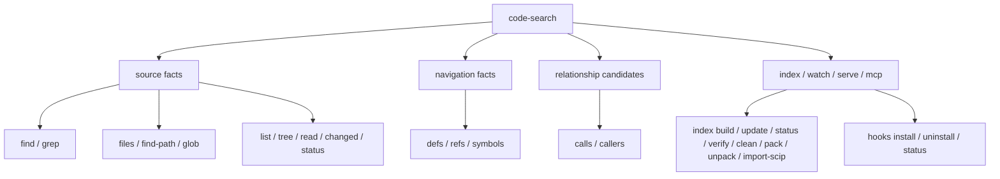
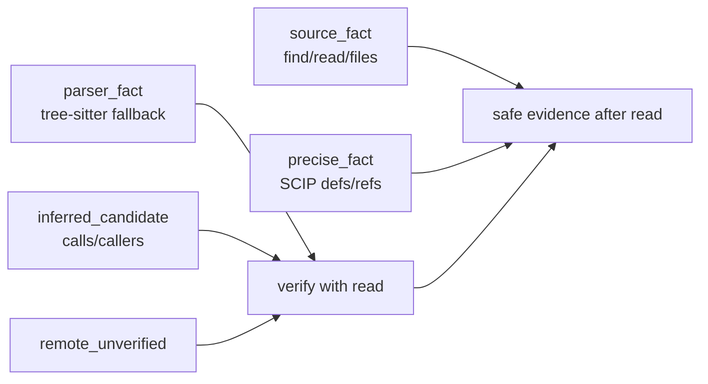

# 命令契约

> 命令参数以 `code-search --help` 和 `src/cli.rs` 为准。本文只保留 Agent 依赖的稳定契约。

## 命令族



| 族 | 命令 | 契约 |
| --- | --- | --- |
| 内容搜索 | `find`, `grep` | 返回可验证源码匹配；index 只影响速度 |
| 路径搜索 | `files`, `find-path`, `glob` | 返回 snapshot 下的路径事实 |
| 浏览读取 | `list`, `tree`, `read` | `read` 是编辑前验证入口 |
| Git 状态 | `changed`, `status` | 返回当前 workspace 与 snapshot 状态 |
| 跳转 | `defs`, `refs`, `symbols` | 优先 SCIP，缺失时降级为 parser/text fallback |
| 关系 | `calls`, `callers` | 永远是 `inferred_candidate` |
| 索引 | `index ...`, `hooks ...` | 维护 freshness 和本地/remote 缓存 |
| Agent 集成 | `mcp`, `serve`, `watch` | 包装同一套 query service 和 watcher 状态 |

## JSON 响应形态

```json
{
  "schemaVersion": "1.0",
  "ok": true,
  "command": "grep",
  "canonicalCommand": "find",
  "query": {
    "pattern": "fn .*status",
    "mode": "regex",
    "normalized": true
  },
  "snapshot_id": "worktree:...",
  "reliability": {
    "level": "source_fact",
    "source": "text_path_git_filesystem",
    "exact": true,
    "llmInstruction": "修改前仍应使用 code-search read 读取精确范围。"
  },
  "index": {
    "used": true,
    "fresh": true,
    "fallback": false
  },
  "budget": {
    "tier": "small",
    "maxResults": 100,
    "maxPreviewChars": 240,
    "maxContextLines": 0,
    "reason": "small_workspace_low_hits"
  },
  "results": [],
  "warnings": []
}
```

稳定字段：

- `command` 保留用户调用的入口名。
- `canonicalCommand` 表示归一化后的能力名。
- `schemaVersion` 使用兼容版本号；同一 major 内只新增可选字段或扩展枚举值，不移除既有稳定字段。
- `query.normalized=true` 表示命令参数已按 CLI 契约归一化，便于 agent 重放与调试。
- `snapshot_id` 表示结果绑定的 Git/worktree 视角。
- `reliability` 告诉 Agent 是否能把结果当作事实。
- `index` 只描述缓存是否参与和是否新鲜。
- `budget` 描述本次输出预算：`tier` 按仓库规模/命中量分为 `small`、`medium`、`large`，并暴露 `maxResults`、`maxPreviewChars`、`maxContextLines` 和 `reason`。宽查询 guard 仍是硬保护；budget 是常规输出压缩策略。
- `noMatch` 只出现在搜索/导航类命令的空结果响应中，说明空结果原因、实际 scope、index 使用状态，并配套可执行 `nextActions`。空结果不代表符号或文本不存在。
- `ambiguity` 只出现在同名符号候选过多的响应中，按语言、kind、路径等维度分组，并通过 `nextActions` 给出收窄命令。
- `warnings` 必须暴露 fallback、stale、remote mismatch 或 heuristic 边界；每条 warning 使用 `{code,message}` 结构，`code` 稳定、可匹配。

## 可靠性流转



规则：

- `exact=true` 只允许出现在 `source_fact` 或 `precise_fact`。
- `parser_fact` 可以是确定性语法事实，但不能代表 precise semantic reference resolution。
- `calls` 和 `callers` 即使来自图索引，也必须标为候选。
- remote 结果必须声明是否与本地文件 proof 对齐。
- Agent 修改代码前应对关键结果执行 `read <file[:range]>`。

## Text 输出

`--output json` 是默认 Agent 契约，保留完整字段、preview/context、`suggestedReads` 和 `nextActions`。

`--output compact-json` 保留同一 envelope 与可验证字段，但移除 `preview`、`context`、`content`、`matchText` 这类大字段；Agent 仍应通过 `readCommand` 精确读取源码。

`--output jsonl` 面向长结果流式消费：每条命中输出一个 `result` event，最后输出一个 `summary` event；错误输出 `error` event。

`--output text` 只面向人类快速查看，不是 Agent 契约。

## 退出码

| code | 含义 |
| --- | --- |
| `0` | 命令成功 |
| `1` | 参数、用法或内部执行错误 |
| `2` | 搜索完成但没有匹配 |
| `6` | 索引存在但 freshness/verify 失败 |

其它错误码由实现按错误类型继续细化；脚本和 CI 应优先检查 JSON 与进程退出状态。
