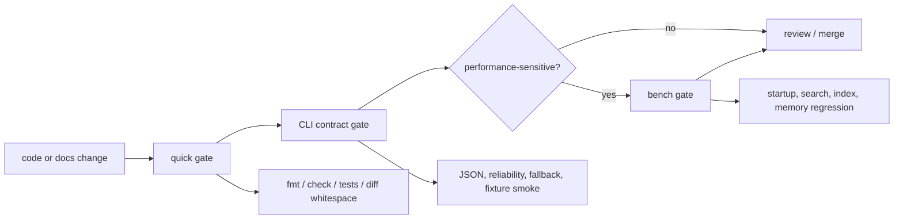
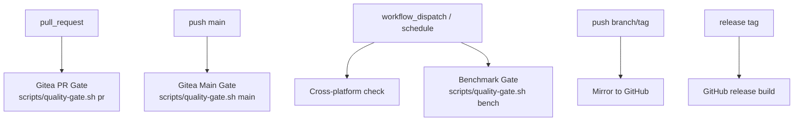

# 质量

> 本文保留验证入口和门禁边界。具体检查命令以 `scripts/quality-gate.sh` 和 CI 配置为准。

## 验证流



统一入口：

```bash
scripts/quality-gate.sh quick
scripts/quality-gate.sh cli
scripts/quality-gate.sh bench
scripts/quality-gate.sh full
```

## 门禁分层

| 层级 | 保护对象 | 入口 |
| --- | --- | --- |
| 静态卫生 | 格式、编译、diff whitespace | `quick` |
| 单元行为 | parser、index、watcher、query helpers | `cargo test --lib` 或 `quick` |
| CLI 契约 | JSON schema、reliability、exit code、fallback | `cargo test --test cli` 或 `cli` |
| 真实仓库 smoke | 开发者和自动化工具常用 L0 命令 | `cli`，当 `TEST_REPO` 存在时运行 |
| 性能回归 | 启动、搜索、索引、内存 | `bench` |

## CI 映射



- `.gitea/workflows/quality-gate.yml` 调度质量门禁。
- `.gitea/workflows/mirror-github.yml` 负责 GitHub mirror；mirror 失败不等同于 PR quality gate 失败。
- `.github/workflows/release.yml` 只负责 release artifact 构建。
- CI 入口复用 `scripts/quality-gate.sh`，避免本地和远端门禁漂移。

## 质量信号

| 信号 | 失败含义 |
| --- | --- |
| Schema drift | 自动化调用方依赖字段缺失、改名或类型漂移 |
| Reliability drift | 候选结果被标成 exact，或 precise/parser/source 边界混淆 |
| Freshness bypass | stale index 被继续使用，或 fallback 未显式声明 |
| Snapshot confusion | HEAD、staged、worktree 结果混用 |
| Remote mismatch | remote 结果未标注 verified/unverified |
| Performance regression | 常用搜索、索引或启动路径超过阈值 |

## 贡献者检查清单

- 新增命令或 JSON 字段时，补充 CLI contract 测试，并更新 `02-command-contract.md`。
- 新增索引、remote、watcher 或 graph 行为时，补充 freshness/reliability 断言，并更新 `01-architecture.md`。
- 性能敏感路径需要更新或确认 `scripts/baseline_values/` 中的基线。
- 文档示例应能对应到真实命令、测试或源码路径。
